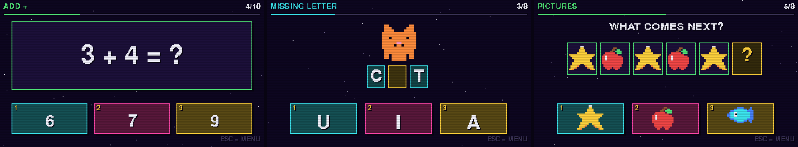
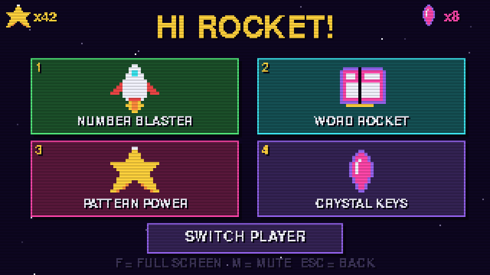
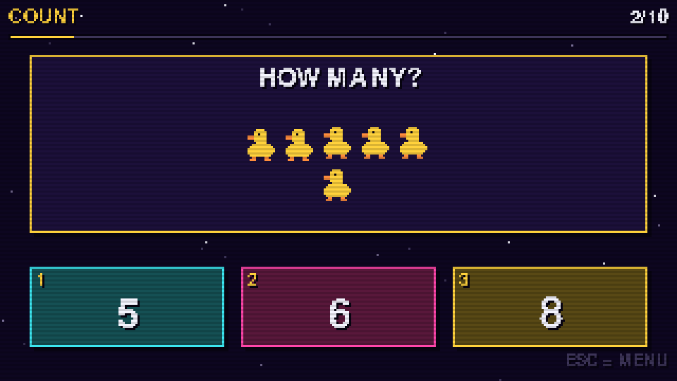
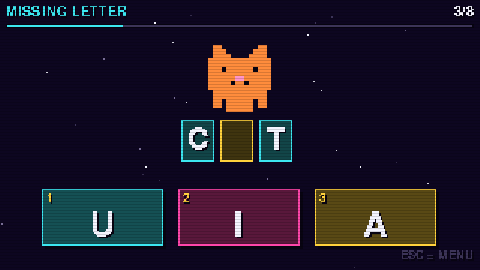
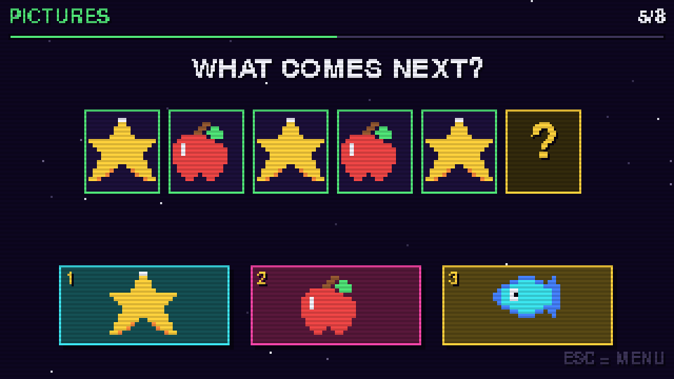
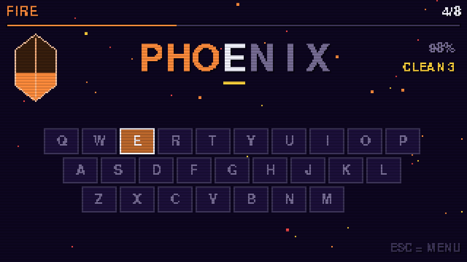

# Retro Learning Arcade



Four little learning games for kids, in Python, with chunky 8-bit graphics and
chiptune bleeps. The first three are built for a six-year-old: big buttons,
almost no reading required, nothing to lose, and a star for every question
answered right on the first go. The fourth, a typing tutor, is pitched a
little older -- around seven to nine.

Everything is drawn onto a 320x180 pixel screen and then blown up to fill the
window, which is what gives it the retro look. The game itself loads no image
or sound files at all: the pictures are hand-drawn pixel grids in
`retro/sprites.py` and every sound is a square wave generated at startup.
(The PNGs above live in `docs/` for this README, and the game never touches
them.)

## What it looks like

<p align="center">
  
  
</p>
<p align="center">
  
  
</p>
<p align="center">
  
</p>

Every screenshot is a real frame from the game, scanlines and all, produced by
`tools/screenshots.py`. Re-run it after a UI change to refresh them.

## Running it

### With uv (recommended)

[uv](https://docs.astral.sh/uv/) handles Python and pygame for you, so there
is no virtual environment to think about. Play without cloning anything:

```sh
uvx --from git+https://github.com/SonicDMG/retro-learning-arcade retro-arcade
```

From a clone, it's one command — uv reads `pyproject.toml`, installs what's
missing and starts the game:

```sh
git clone https://github.com/SonicDMG/retro-learning-arcade.git
cd retro-learning-arcade
uv run retro-arcade
```

To keep it on the machine as a normal command:

```sh
uv tool install git+https://github.com/SonicDMG/retro-learning-arcade
retro-arcade
```

`uv.lock` pins the exact pygame build, so every machine gets the same one.
Don't have uv? `curl -LsSf https://astral.sh/uv/install.sh | sh`.

### On the Mac, without touching a terminal

1. Copy this folder anywhere you like (Documents is fine).
2. Double-click **`run.command`**.

It uses uv if it finds it, and otherwise falls back to building a plain
virtual environment with the system Python — so it works either way. The
first run takes a minute; after that it starts straight away.

If macOS refuses to open it ("unidentified developer"), right-click
`run.command` → **Open** → **Open**. That only has to be done once.

### Without uv

```sh
python3 -m venv .venv
./.venv/bin/python -m pip install -r requirements.txt
./.venv/bin/python launcher.py
```

macOS ships with a usable `python3`; if it's missing, the launcher will say so
and point at python.org.

### Where progress is saved

Run from a clone, the save file sits in `saves/progress.json` next to the
code. Installed as a tool, it goes to the platform's user data directory
(`~/Library/Application Support/RetroLearningArcade` on macOS) — writing
inside the installed package would mean a reinstall quietly wiped the kids'
stars. Set `RETRO_ARCADE_SAVE_DIR` to put it anywhere else.

## The games

**Number Blaster** — four modes, each ten questions long:

| Mode | What it practises |
| --- | --- |
| Count | Counting a group of pictures, 1–15 |
| Add + | Sums up to 10, 15 or 20 |
| Take away − | Subtraction, never below zero |
| More or less | Comparing two numbers |

**Word Rocket** — a picture appears and the word sits underneath:

| Mode | What it practises |
| --- | --- |
| First letter | Initial sounds |
| Missing letter | Letter sounds anywhere in a word |
| Spell it! | Building the whole word, left to right |

**Pattern Power** — a sequence appears with the last slot blank:

| Mode | What it practises |
| --- | --- |
| Pictures | Repeating patterns (AB, ABB, AAB, ABC) |
| Colours | The same idea, without any picture naming |
| Numbers | Counting on and back in 1s, 2s, 5s and 10s |

**Crystal Keys** — a typing tutor, for around ages 7-9. Four elemental realms,
which are really keyboard lessons in disguise:

| Realm | Keys it uses | What it practises |
| --- | --- | --- |
| 🌱 Earth | Home row only (`asdfghjkl`) | Finding the home keys without looking |
| 💧 Water | Adds the top row (`qwertyuiop`) | Reaching up and coming back |
| ☁️ Air | Adds the bottom row (`zxcvbnm`) | The whole alphabet |
| 🔥 Fire | Everything, longer words | Speed and stamina |

Each realm starts with pure drills (`asdf`, `jkl`) and moves on to themed
words. A wrong key never ends anything — the letter simply refuses to advance,
the way a real typing tutor works, so fingers learn the correct key instead of
racing past it. An on-screen keyboard lights up the next key to press, and
Caps Lock doesn't matter.

Finishing a realm earns **crystals**: one for completing it, one for 90%
accuracy or better, and one more for a flawless round. They're deliberately
rarer than stars.

Three difficulty levels (EASY / OK / HARD) set the number ranges in Number
Blaster. A six-year-old usually wants EASY or OK.

## How it plays

Pick a player (Rocket, Kitty or Star), pick a game, answer the round.
Answers can be clicked with the mouse or chosen with the `1` `2` `3` keys; in
Word Rocket the child can also just press the letter key.

A wrong answer costs nothing — it fades out, the game says TRY AGAIN, and
after two misses the right answer starts flashing yellow so nobody gets
stuck. A round always ends with confetti and a star count, never a "game
over".

Stars are saved per player in `saves/progress.json`, along with each game's
best score. Delete that file to reset everything.

### Sound

Every effect is a square, triangle, saw or noise wave built from scratch at
startup in `retro/sfx.py` — there are no audio files to lose. The set is small
on purpose, so each one means exactly one thing:

| Sound | Fires on |
| --- | --- |
| `click` / `select` / `back` | Moving around the menus |
| `correct` | A right answer, rising three notes |
| `wrong` | A wrong answer — soft and low, never a buzzer |
| `pop` | A letter dropping into place in Word Rocket |
| `launch` | The rocket taking off after a correct sum |
| `star` | Three correct in a row, so a streak is audible |
| `charge` | A crystal finishing charging in Crystal Keys |
| `record` | A new best score, once the stars finish landing |
| `fanfare` | The end of a round |

Two things climb rather than repeat: each letter typed in Crystal Keys plays
the next note of a rising pentatonic run, so a word resolves like a little
tune, and the stars on the results screen chime a step higher each, so a big
score sounds bigger than a small one.

Failure is deliberately gentle. The wrong-answer tone is a low triangle wave,
quieter than the success sounds, because a harsh buzzer teaches a child to
fear being wrong. `M` mutes everything.

### Keys

| Key | Does |
| --- | --- |
| `1` `2` `3` | Pick an answer |
| Mouse click | Pick an answer |
| Letter keys | Type, in Crystal Keys |
| `F` | Full screen on/off |
| `M` | Mute/unmute |
| `Esc` | Back one screen |
| `Cmd-Q` | Quit |

## Making it your own

The project is meant to be tinkered with, ideally alongside the kids.

**Add a word to Word Rocket.** Draw a 16x16 picture in `retro/sprites.py` as a
grid of characters plus a colour key, register it in the `SPRITES` dict, then
add the word to `WORDS` in `games/word_rocket.py`. Only add words whose
picture is obvious at that size.

**Change the sums.** `LIMITS` and `ADD_CAP` at the top of
`games/math_blaster.py` control every number range.

**Change the patterns.** `UNITS` in `games/pattern_power.py` lists the
repeating shapes (AB, AAB and so on); add `(0, 1, 0, 2)` or similar for a
harder mix.

**Add typing words.** `LESSONS` in `games/crystal_keys.py`. Keep each word
inside its element's key set — the tests will tell you if you slip.

**Change the round length.** `ROUND_LENGTH` in either game.

**Add a whole new game.** Subclass `Scene` from `retro/app.py`, implement
`handle_event`, `update` and `draw`, hand your finished round to
`ResultsScene`, and add it to the `GAMES` list in `launcher.py`. The widgets
in `retro/ui.py` (buttons, panels, starfields, particles) and the sounds in
`retro/sfx.py` are shared by everything.

## Layout

```
launcher.py            Player picker and game shelf
games/math_blaster.py  Number Blaster
games/word_rocket.py   Word Rocket
games/pattern_power.py Pattern Power
games/crystal_keys.py  Crystal Keys, the typing tutor
retro/app.py           Window, scaling, scene stack, main loop
retro/ui.py            Buttons, text, panels, starfield, particles
retro/sprites.py       All the pixel art
retro/sfx.py           Synthesised sound effects
retro/results.py       Shared end-of-round screen
retro/progress.py      Star and best-score saving
retro/palette.py       Colours
tests/                 Checks on the question generators and the art
tools/screenshots.py   Regenerates the images in this README
docs/screenshots/      Those images
pyproject.toml         Dependencies and the retro-arcade command
uv.lock                The exact pygame build, pinned
```

## Tests

```sh
uv run python -m unittest discover tests   # or plain: python3 -m unittest discover tests
```

These cover the parts that would quietly teach a child something wrong: the
right answer is always among the choices, sums never exceed the level cap,
subtraction never goes negative, the number of pictures always matches the
answer, number sequences step evenly and never go below zero, every repeating
pattern genuinely repeats, and every sprite grid is well-formed.

They also guard the typing ladder: no lesson may use a key its element hasn't
introduced yet, and Earth stays strictly home row. That check earned its keep
immediately — it caught "river" and "stream" sitting in the Water lesson, both
of which need bottom-row keys the child hasn't met at that point.

The sound tests inspect the generated waveforms directly, since a synthesis
bug that produced silence or clipping would be invisible on screen: every
effect must be audible, must not clip, must match its recipe's duration, and
must actually be played by some game.

`tests/test_packaging.py` covers the quiet failures: that the `retro-arcade`
entry point resolves, that the wheel ships every module the game imports,
that `requirements.txt` hasn't drifted from `pyproject.toml`, and that an
installed copy never writes a child's progress inside site-packages.
